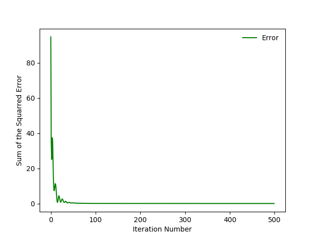
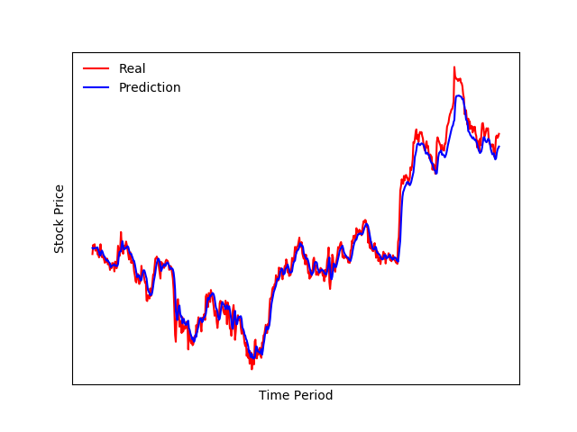
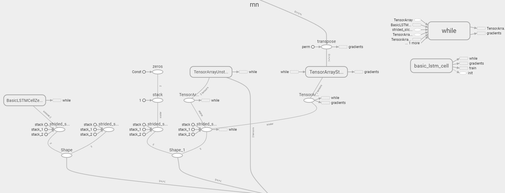

# rnn_stock_predictions
data Crawling, Pretreatment, Processing, Training, Model Visualization -> AUTOMATION

# requirments
  - Python 3.5.3
  - tensorflow 1.1.0
  - Pandas_datareader
  - numpy
  - matplotlib
  - datetime

# Run
  - python apple.py
  - python kospi.py
  - tensorboard --logdir=./tensorflowlog
  - tensorboard
    http://localhost:6006/   
    graphs

# Model
  - RNN + Fully connected layer
  - Train : Test = 70 : 30
  - Train Period = 2010.1.2~2017.5.27
  - Predictions Period = 2017.5.28~2017.6.7
  - Real Period = 2017.6.8

# Results
  - Alphabet 0.050(RMSE) 1004.28(Real) 1001.59(Predictions)
  - apple 0.020(RMSE) 154.99(Real) 155.37 (Predictions)
  - berkshire 0.016(RMSE) 250305(Real) 249621 (Predictions)
  - hyundai_motor 0.020(RMSE) 160000(Real) 159000 (Predictions)
  - kospi  0.022(RMSE) 2363.57(Real) 2360.14(Predictions)
  - samsung_electronics 0.022(RMSE) 2258000(Real) 2265000(Predictions)   
  - sk_hynix 0.024(RMSE) 56700(Real) 56500(Predictions)  
  - berkshire  

  
  
  

# Reference
  - https://github.com/hunkim/DeepLearningZeroToAll